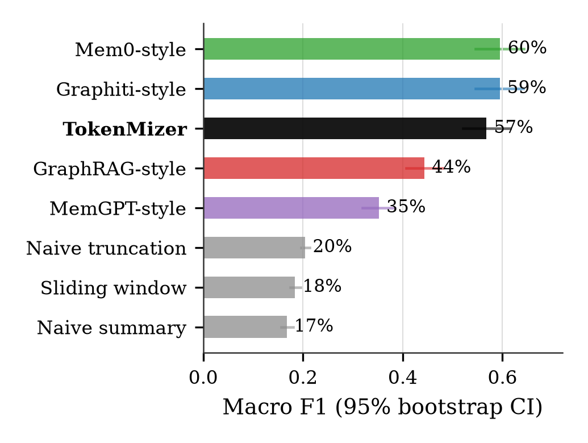

# TokenMizer Research

Research repository for **TokenMizer**, a graph-structured session-memory
system for long-horizon LLM context management. This repository contains
the benchmark suite, the labelled evaluation corpus, all raw results, and
the manuscript for the associated paper. The product itself is maintained
separately at
[`Shweta-Mishra-ai/tokenmizer`](https://github.com/Shweta-Mishra-ai/tokenmizer).

## Paper

**TokenMizer: Graph-Structured Session Memory for Long-Horizon LLM Context
Management** (IEEE Transactions format, journal manuscript)
Shweta Mishra, 2026.

[`paper/tokenmizer_ieee.pdf`](paper/tokenmizer_ieee.pdf) ·
[LaTeX source](paper/tokenmizer_ieee.tex)

The manuscript is a single, current-state evaluation: it reports one
controlled 100-session, 8-method comparison of the released TokenMizer
0.5.3 product against deterministic reimplementations of MemGPT, Mem0,
Graphiti/Zep, and GraphRAG plus three naive baselines, with bootstrap
confidence intervals on every reported comparison.

### Headline results (n = 100, TokenMizer 0.5.3)



| Method | Macro F1 | 95% CI |
|---|---:|---:|
| Mem0-style | 60% | [55%, 64%] |
| Graphiti-style | 59% | [55%, 64%] |
| **TokenMizer 0.5.3** | **57%** | [52%, 62%] |
| GraphRAG-style | 44% | [41%, 48%] |
| MemGPT-style | 35% | [32%, 38%] |
| Naive truncation | 20% | [20%, 21%] |
| Sliding window (10) | 18% | [18%, 19%] |
| Naive summary | 17% | [16%, 18%] |

TokenMizer significantly outperforms GraphRAG-style, MemGPT-style, and
every naive baseline. Against Graphiti-style and Mem0-style, the
paired-difference confidence interval crosses zero: a statistical tie,
not a loss and not a win. TokenMizer's resume block (99 tokens) is
smaller than Graphiti-style's and Mem0-style's (118–120) but larger
than MemGPT-style's (60), which reaches that size by seeing under half
the conversation rather than by encoding it more efficiently. Its two
weakest categories, both in absolute terms and relative to the two
methods it otherwise ties, are decision extraction (50% F1, against 65%
for Graphiti/Mem0-style) and error extraction (36% F1, against 66%).
Every pattern-matching method tested — TokenMizer included — degrades
to 19–25% macro F1 on sessions that state facts indirectly rather than
with explicit lexical markers, a shared limitation of regex-based
extraction quantified here across four independently implemented
strategies on one corpus.

Four of the seven comparison methods reproduce one structural property
of a published system, deterministically and with no language-model
call — they are not the vendor products. See
`benchmarks/memorybench/methods/` and the paper's Threats to Validity
section before quoting any of these four under the named system's
identity.

## Repository layout

```
paper/                    Manuscript source, figures, and compiled PDF
  tokenmizer_ieee.tex        IEEE-format manuscript (this repo's primary output)
  figures/                   Publication figures + generator script
  fig1_architecture.png,     Architecture figures referenced by the manuscript
  fig2_graph.png

benchmarks/
  memorybench/               n=100 multi-method benchmark: corpus loader,
                              scorer, synthetic-session generator, and all
                              eight method implementations
  corpus/                    100 labelled sessions (94 generated, 6 real)
  results/                   Raw results (JSON/CSV), REPORT_n100.md,
                              interactive dashboard.html
  checkpoint_accuracy/       Earlier 21-session benchmark, kept for history;
                              not covered by the current manuscript
```

## Reproducing the results

No installation is required; the benchmark suite is pure standard-library
Python.

```bash
git clone https://github.com/Shweta-Mishra-ai/tokenmizer-research
cd tokenmizer-research

# Run the n=100 multi-method benchmark
python -m benchmarks.memorybench.run --json out.json --csv out.csv

# Regenerate the 94-session synthetic corpus (seeded, deterministic)
python -m benchmarks.memorybench.generate -n 86

# Run the earlier 21-session benchmark (kept for history, not covered by the paper)
python3 benchmarks/checkpoint_accuracy/runner_v2.py
```

Reproducing TokenMizer's own results additionally requires a checkout of
the product repository (path configurable via `TOKENMIZER_PRODUCT_REPO`,
default `/home/user/tokenmizer`); the other seven methods have no external
dependency.

Regenerating the manuscript's figures requires `matplotlib` and `numpy`;
recompiling the PDF requires a LaTeX distribution with the `IEEEtran`
class (`texlive-publishers` on Debian/Ubuntu):

```bash
pip install matplotlib numpy
python3 paper/figures/generate_figures.py
cd paper && pdflatex tokenmizer_ieee.tex && pdflatex tokenmizer_ieee.tex
```

Full methodology, per-category and per-register breakdowns, and stated
limitations: [`benchmarks/results/REPORT_n100.md`](benchmarks/results/REPORT_n100.md).
Interactive results dashboard: [`benchmarks/results/dashboard.html`](benchmarks/results/dashboard.html).

## Citation

```bibtex
@article{mishra2026tokenmizer,
  author  = {Mishra, Shweta},
  title   = {TokenMizer: Graph-Structured Session Memory for
             Long-Horizon LLM Context Management},
  year    = {2026},
  note    = {Manuscript and reproduction code available at
             \url{https://github.com/Shweta-Mishra-ai/tokenmizer-research}}
}
```

## Contributing

See [`CONTRIBUTING.md`](CONTRIBUTING.md). Priority areas: real labelled
transcripts, LLM-backed variants of the comparison methods, additional
domains and threshold-sensitivity analysis.

## License

MIT License © Shweta Mishra 2026. See [`LICENSE`](LICENSE).
