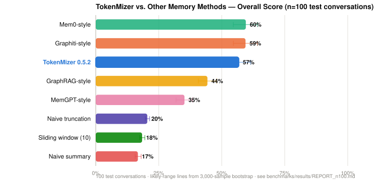

# TokenMizer 🧠
**Graph-Structured Session Memory for Long-Horizon LLM Context Management.**
TokenMizer is an open-source, transparent reverse proxy that models iterative LLM session history as a typed knowledge graph. By extracting structured state transitions, decisions, and file modifications on the fly, it serializes long conversation histories into highly compact context resume blocks—minimizing context window degradation without requiring changes to your application code.
License: MIT

Python 3.10+

FastAPI
## The Problem: Context Window Degradation
In iterative developer or data science sessions, interactions grow long and repetitive. At an average volume of 950 tokens per turn, a standard 16k-token Maximum Effective Context Window (MECW) is exhausted in roughly 16 turns.
When context overflows or sliding windows discard early tokens, critical session history is lost:
 * Architectural decisions and structural choices made early vanish.
 * Explicit task lifecycles (what is completed vs. what is pending) become blurred.
 * Free-text summarizations blur nuance (e.g., failing to distinguish a choice made from a choice rejected).
## The Solution: Structural State Resuming
TokenMizer intercepts raw session tokens, passes them through a deterministic compression and extraction framework, maintains a localized knowledge graph, and compresses long-horizon state into a structured **resume block** averaging **78 tokens**.
```
Standard Stream: [Turn 1-14 Messages (~13.3k tokens)] ──> [Context Overflow / Lost State]
TokenMizer:     [Turn 1-14 Messages] ──> Graph Extraction ──> [78-Token Resume Block Injection]

```
## System Architecture
TokenMizer runs locally as a containerized, lightweight HTTP proxy implementing an OpenAI-compatible Chat Completions interface.
```
Client App (Cursor/Claude Code) ──> TokenMizer Proxy ──> Upstream LLM Provider
                                         │
                    ┌────────────────────┴────────────────────┐
                    ▼                                         ▼
         [Core Processing Engine]                    [Persistent Storage]
         ├── Hybrid Graph Extractor (V2 Heuristics)   ├── SQLite Graph DB
         ├── Three-Tier Checkpoint Manager            └── JSON Checkpoint Store
         ├── 8-Layer Compression Pipeline
         └── Local Semantic Embedding Cache

```
## Quick Start
### 1. Installation & Service Start
Install the proxy package directly via pip:
```bash
pip install tokenmizer

# Set up upstream credentials and serve locally
export ANTHROPIC_API_KEY="sk-ant-..."
tokenmizer serve --host 127.0.0.1 --port 8000

```
### 2. Client Integration
Point your local environment, IDE proxy, or OpenAI/Anthropic client to the TokenMizer endpoint. Activating the workflow requires passing a tracking string (session_id) inside the request body payload.
```python
from openai import OpenAI

client = OpenAI(base_url="http://localhost:8000/v1", api_key="passthrough")

response = client.chat.completions.create(
    model="claude-sonnet-4-6",
    messages=[{"role": "user", "content": "Refactor the database connection to use connection pooling."}],
    extra_body={"session_id": "production-backend-refactor"}
)

```
*Note: If no session_id is passed, the proxy executes a zero-overhead, direct passthrough to the upstream provider.*
## Core Engine Components
### 1. Knowledge Graph Schema
The structural session memory uses an identity-addressed graph model mapping 14 distinct node classifications and 7 transactional edge types:
 * **Action Nodes (with active lifecycles):** TASK, FILE, ERROR, TEST, SCHEMA, METRIC
 * **Decision Nodes:** DECISION, DEPENDENCY, API
 * **Context Nodes (static state):** GOAL, ENVIRONMENT, PROJECT, CONCEPT, AGENT
 * **Semantic Relationships:** DEPENDS_ON, RELATED_TO, IMPLEMENTS, FIXES, BLOCKS, PART_OF, SUPERSEDES
### 2. The 8-Layer Compression Pipeline
Large raw texts (monolithic files, long API payloads, system context dumps) pass through an automated compression sequence before being indexed or contextually re-injected:
 1. **AI Filler Removal:** Strip conversational preambles and hedging patterns (-31.2% mean reduction).
 2. **Order-Preserving Line Deduplication:** Pruning recursive stack traces, logs, and duplicate code blocks (-16.1% mean reduction).
 3. **Whitespace Normalization:** Compressing blank lines and formatting tokens.
 4. **Targeted Comment Stripping:** Language-aware syntax pruning (#, //, --).
 5. **History Pruning:** Iterative validation of lengthy historical context payloads.
 6. **Smart Truncation:** Object-aware context rules (e.g., schemas + top 3 lines for data tables).
 7. **Neural Compaction (Optional Layer 7-8):** Integrating LLMLingua-2 and LongLLMLingua configurations for payloads crossing strict size thresholds.
### 3. Local Semantic Cache
Built on a localized sentence-transformer pipeline (all-MiniLM-L6-v2), the cache stores upstream responses locally. Incoming requests are vectorized and run against historical semantic vectors using cosine similarity evaluation (\theta = 0.92). Matches return instant local storage records at zero token cost and sub-millisecond latencies.
## Benchmarks
### Latest: 100-Session Multi-Method Test (n=100)
TokenMizer (the real product engine, version 0.5.2) was tested against 7 other memory methods — including rebuilt strategies based on MemGPT, Mem0, Graphiti/Zep, and GraphRAG, plus simple baselines — on 100 test conversations, using the same scoring rules for every method.



| Method | Overall score | Likely true range |
|---|---|---|
| **TokenMizer 0.5.2** | **57%** | 52%–62% |
| Graphiti-style | 59% | 55%–64% |
| Mem0-style | 60% | 55%–64% |
| GraphRAG-style | 44% | 41%–48% |
| MemGPT-style | 35% | 32%–38% |
| Naive truncation | 20% | 20%–21% |
| Sliding window (10) | 18% | 18%–19% |
| Naive summary | 17% | 16%–18% |

**What this shows:**
* TokenMizer clearly beats simple baselines, MemGPT-style, and GraphRAG-style.
* Against Graphiti-style and Mem0-style, the scores are close enough to call it a tie, not a win — though TokenMizer's output is smaller (99 tokens vs. 118–120 tokens).
* TokenMizer's weakest areas are finding **decisions** (50%) and **errors** (36%) in a conversation — the clearest place to improve next.
* Every method tested, including TokenMizer, does much worse (around 20%) when a conversation states facts indirectly instead of using clear markers like "Decided:" or "Completed:". This is a shared limit of pattern-matching, not specific to TokenMizer.

Full write-up, method: [`benchmarks/results/REPORT_n100.md`](benchmarks/results/REPORT_n100.md). Interactive dashboard: [`benchmarks/results/dashboard.html`](benchmarks/results/dashboard.html). Raw data: [`benchmarks/results/memorybench_n100_20260810.json`](benchmarks/results/memorybench_n100_20260810.json). Reproduce with:
```bash
python -m benchmarks.memorybench.run
```

### Earlier: 21-Session Domain Benchmark
The original evaluation, kept for history, used a smaller 21-session synthetic corpus:
| Domain Split | Task Recall | Decision Recall | File Recall | Mean Information Loss |
|---|---|---|---|---|
| **Software Engineering (n=6)** | 47% | 70% | 72% | 37% |
| **Data Science (n=5)** | 69% | 48% | 40% | 48% |
| **DevOps (n=4)** | 45% | 38% | 50% | 56% |
| **Research/Writing (n=3)** | 44% | 44% | 33% | 59% |
| **Debugging (n=3)** | 43% | 11% | 100% | 49% |
| **Aggregate Dataset Mean** | **51%** | **47%** | **59%** | **48%** |

| Metric Backing | Task Recall | Decision Recall | File Recall | Mean Resume Token Footprint |
|---|---|---|---|---|
| Naive Truncation (Last 300 tokens) | 45% | 35% | 55% | 165 tokens |
| Sliding Window (Last 10 messages) | 50% | 30% | **60%** | 159 tokens |
| Naive Summary (Concatenated blocks) | 42% | 38% | 48% | 170 tokens |
| **TokenMizer V2 Engine** | **51%** | **47%** | 59% | **78 tokens** |
## Current Technical Limitations
Practitioners integrating TokenMizer into highly specific developer workflows should be aware of the current architectural parameters:
 * **Heuristic Dependency:** The default processing engine relies on deterministic compiled regex layers. Implicit conversational assertions (e.g., *"Let's tentatively roll out Redis and see how it performs"*) escape traditional trigger matching, contributing to the current decision-recall ceiling — confirmed at n=100 above, where every pattern-based method tested (TokenMizer included) drops to roughly 20% on indirect language.
 * **Overfitting Risks:** The default extraction models are optimized around concrete, action-oriented syntax patterns. Conversations relying on highly implicit or academic prose inherently trigger poor or zero-recall structural matching profiles.
 * **Evaluation Scope:** The n=100 benchmark above adds 4 comparison methods and 79 more sessions over the original n=21 evaluation, but 94 of those 100 sessions are still synthetic, not captured production transcripts. Production evaluation on dynamic, live developer histories remains active, unquantified work.
## Data Privacy & Security Guardrails
TokenMizer is designed for air-gapped security compliance:
 * **Zero Telemetry Leakage:** The graph extraction layer, regex processors, caching databases, and embedding functions execute completely in-memory or within localized persistent SQLite layers. No payloads are transferred over public monitoring networks.
 * **Credential Redaction:** Input tokens are parsed through pre-extraction sanitization filters targeting API tokens, cryptography blocks, and environment passwords, masking matches immediately to [REDACTED].
## Development & Test Automation
Run tests inside a isolated virtual environment using the local development suite:
```bash
# Clone and enter directory
git clone https://github.com/Shweta-Mishra-ai/tokenmizer.git
cd tokenmizer

# Editable developer install
pip install -e ".[dev]"

# Execute full testing pipeline (unit, integration, and structural mutations)
pytest tests/ -v --cov=tokenmizer

```
## License
This architecture is distributed under the open-source **MIT License** © Shweta Mishra 2026.
